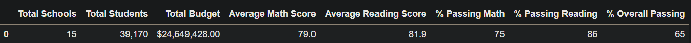
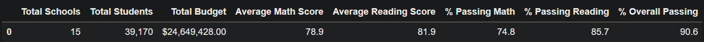
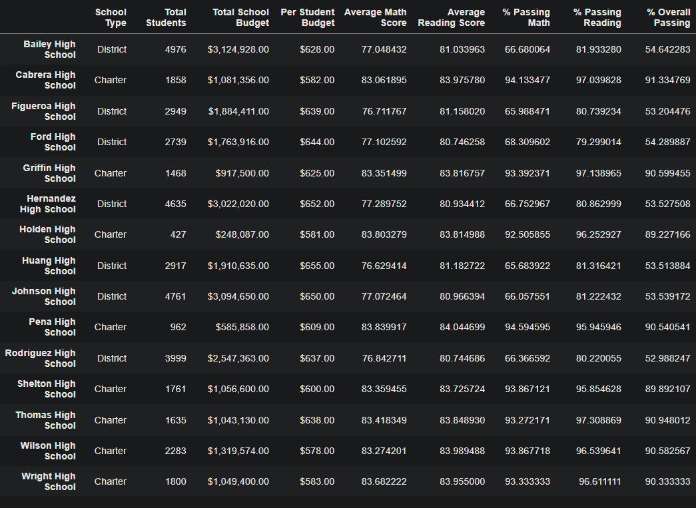
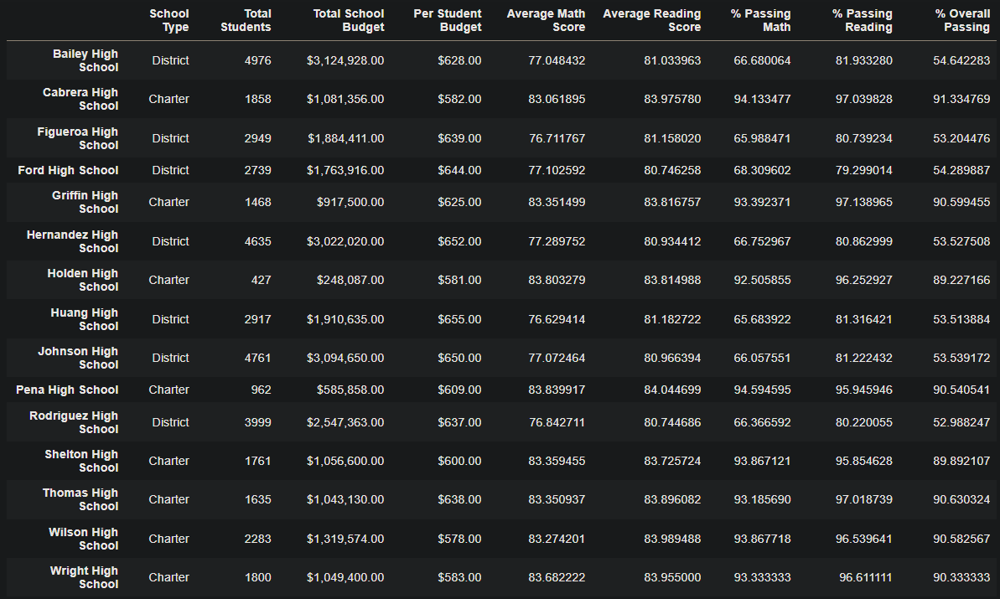
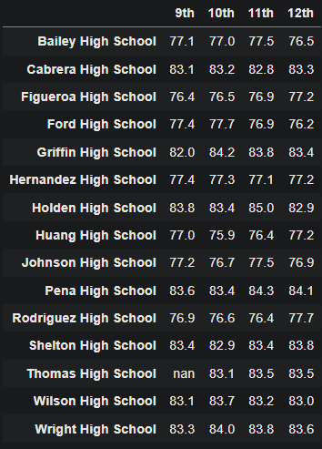
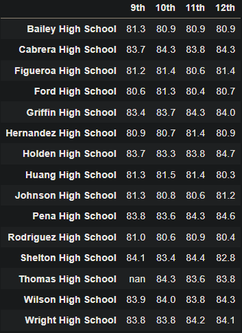

# School_District_Analysis
## Overview
During our meeting with Maria, she asked us to assist in analyzing the data of the schools in her district, and present the data in table format. We are to include the performance of each school based on math and reading scores along with the the budget, size, and type of each school. Due to academic dishonesty, we were asked to replace the reading and math scores for Thomas High School with NaNs and analyze how the outcomes were effected. 

## Results
  - District Summary with THS Scores
    
    District Summary without THS Scores
    
    - Average Math Score decreased by <1%
    - Average Reading Score remained unaffected
    - % Passing Math decreased by <1%
    - % Passing Reading decreased by <1%
    - % Overall Passing decreased by <1%
  - School Summary with THS Scores
    
    School Summary without THS Scores
    
    - We can see that changing the 9th grade scores to NaNs, only changed THS's overall passing percentage by less than 1% and didn't change the rankings at all. 
  - How does replacing the ninth-grade scores affect the following:
    - we can see in the school summary tables, that the math and reading scores
    - 
  - Math and reading scores by grade
    - Math Scores by Grade
    
      
    - Reading Scores by Grade
    
       
    -asdf
    
    -asdf
    
    -asdf
    
    -asdf
  
## Summary
